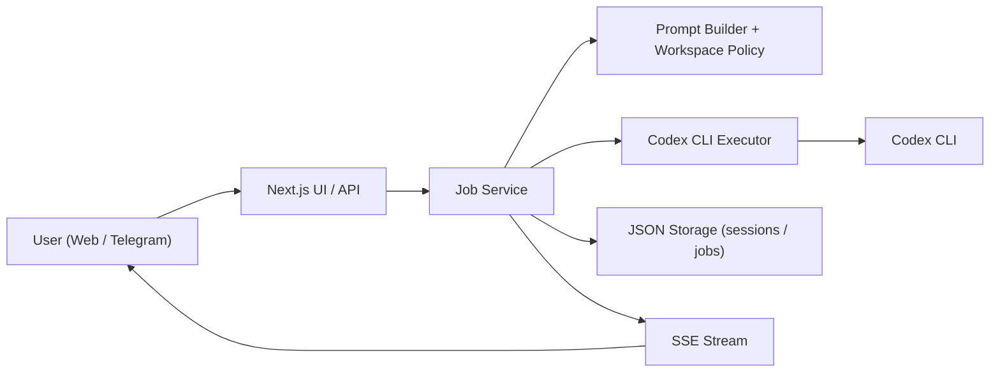

# Codexia

Codexia는 Codex의 개발자 친화적인 멀티 에이전트 작업 흐름을 웹에서 다루기 위한 애플리케이션입니다.  
웹 UI에서 요청을 받으면 Next.js API가 작업을 생성하고, 서버가 Codex CLI를 실행한 뒤 결과를 스트리밍으로 다시 전달합니다.

이 프로젝트의 핵심 목적은 단순한 개인 개발용 챗봇이 아니라, 개발자가 세션과 작업을 관리하면서 Codex 기반 멀티 에이전트 실행 흐름을 사용할 수 있는 워크스페이스를 만드는 것입니다.  
세션 문맥 유지, 스트리밍 응답, 작업 이력 보관, 모델/사고수준 제어, 워크스페이스 보호, Telegram 연동까지 한 저장소 안에서 다룹니다.

## 왜 만들었나

일반적인 챗봇 인터페이스는 다음 문제가 있습니다.

- 세션 문맥이 불안정하다
- 코드 작업 흐름과 연결이 약하다
- 응답 생성 과정과 실행 상태를 추적하기 어렵다
- 멀티 에이전트 실행 흐름을 UI에서 통제하기 어렵다
- 개발용 워크스페이스 보호 정책을 넣기 어렵다

Codexia는 이 문제를 다음 방식으로 해결하려고 합니다.

- Codex의 멀티 에이전트 실행 경험을 웹 워크스페이스로 감싼다
- 세션별 JSON 저장소로 대화 이력을 유지
- Codex CLI를 서버에서 직접 실행
- 응답을 SSE로 스트리밍
- 작업 단위를 `job`으로 분리해 진행 상태를 추적
- 보호 경로, 승인 필요 경로 같은 워크스페이스 정책 반영
- 웹 UI 외에 Telegram에서도 같은 에이전트를 호출 가능

## 핵심 기능

- Codex 기반 멀티 에이전트 워크스페이스
- 세션 기반 대화 저장
- Codex CLI 실행 결과 스트리밍
- `job` 단위 상태 추적
- Trace 모드에서 사고 로그, 실행 명령, 사용량 이벤트 표시
- 모델 선택과 사고수준 선택
- `@파일경로` 자동완성 기반 파일 참조 보조
- 세션 목록 조회, 재진입, 삭제, 활성 작업 강제 종료
- Telegram 웹훅 기반 에이전트 호출
- 워크스페이스 루트/보호 경로/코어 경로 정책 적용

## 한눈에 보는 구조



## 동작 방식

1. 사용자가 웹 UI 또는 Telegram에서 메시지를 보냅니다.
2. 서버는 `sessionId` 기준으로 세션을 로드합니다.
3. `job-service`가 새 작업을 만들고 `data/jobs`에 저장합니다.
4. 프롬프트 빌더가 최근 대화와 시스템 프롬프트를 조합합니다.
5. Codex CLI를 고정 경로에서 실행합니다.
6. 결과는 `chunk`, `reasoning`, `command`, `usage` 같은 이벤트로 누적됩니다.
7. 웹에서는 SSE로 실시간 표시되고, 완료 후 `data/sessions`에 최종 응답이 저장됩니다.

## 기술 스택

- Frontend: Next.js 16, React 19
- Backend: Next.js Route Handlers (Node.js runtime)
- Language: TypeScript
- Styling: Tailwind CSS 4
- Agent Runtime: Codex CLI
- Storage: 로컬 JSON 파일
- Transport: HTTP + SSE

## 현재 아키텍처

프로젝트는 가벼운 Clean Architecture 분리를 따릅니다.

- `src/core`
  - 타입, 모델 정의, 프롬프트 빌더, 워크스페이스 정책
- `src/application`
  - 작업 생성, 상태 전이, 세션-잡 오케스트레이션
- `src/infrastructure`
  - Codex CLI 실행기, 세션 파일 저장소, Telegram poller runtime
- `src/presentation`
  - 웹 UI ViewModel, 메시지 렌더링, 서버 스트림 응답
- `app`
  - Next.js 페이지와 API 엔트리포인트
- `components`
  - 공용 UI 컴포넌트
- `data`
  - 세션/잡/Telegram 상태 저장소

### 주요 디렉터리

```text
app/
  agent/
  api/
components/
config/
data/
docs/
lib/
src/
  application/
  core/
  infrastructure/
  presentation/
```

## 화면과 사용자 경험

### 메인 화면

- 저장된 세션 목록 조회
- 마지막 작업 시각 확인
- 세션 재진입
- 세션 삭제
- 현재 활성 작업 일괄 종료

### 에이전트 화면

- 새 세션 자동 생성 또는 기존 세션 재사용
- 모델 선택
- 사고수준 선택
- Trace 모드 on/off
- 프롬프트 길이와 컨텍스트 사용량 시각화
- 스트리밍 답변 표시
- `@파일명` 자동완성으로 파일 참조 힌트 제공

### Trace 모드

Trace 모드가 켜져 있으면 Codex CLI를 JSON 출력 모드로 실행합니다.

- 사고 로그 표시
- 현재 실행 중인 명령 표시
- 토큰 사용량 이벤트 반영
- 첫 응답 시간(ttfb) 같은 메트릭 수집

## 실행 전 요구사항

### 1. Node.js

- Node.js 22 계열 권장
- 현재 저장소의 개발 스크립트는 `node --experimental-strip-types`를 사용합니다
- 현재 확인한 로컬 실행 버전은 `v22.18.0`입니다

### 2. 패키지 매니저

- `pnpm` 사용 권장
- 저장소에는 `pnpm-lock.yaml`이 포함되어 있습니다

### 3. Codex CLI

이 프로젝트는 서버에서 Codex CLI를 직접 실행합니다.  
현재 코드 기준으로 Codex 실행 파일은 아래 고정 경로 중 하나에 있어야 합니다.

- `/Users/ethan/.bun/bin/codex`
- `/Users/ethan/.npm-global/bin/codex`
- `/opt/homebrew/bin/codex`
- `/usr/local/bin/codex`
- `CODEX_CLI_PATH` or `CODEX_PATH`
- `PATH` lookup for `codex`, `codex.exe`, `codex.cmd`

코드가 임의 PATH 검색을 하지 않기 때문에, Codex CLI가 다른 위치에 있다면 다음 중 하나가 필요합니다.

- 위 경로 중 하나로 심볼릭 링크 생성
- `src/infrastructure/agent/codex-cli-executor.ts` 수정

## 설치 방법

### 1. 저장소 클론

```bash
git clone <YOUR_REPOSITORY_URL>
cd codexia
```

### 2. 의존성 설치

```bash
pnpm install
```

### 3. 환경 변수 파일 생성

```bash
cp .env.local.template .env.local
```

### 4. `.env.local` 설정

최소한 아래 항목부터 맞추는 것을 권장합니다.

```env
AGENT_WORKSPACE_ROOT=/Users/yourname/Workspace
AGENT_PROTECTED_PATHS=codexia/.env.local
```

Telegram까지 사용할 경우 다음도 추가해야 합니다.

```env
TELEGRAM_BOT_TOKEN=YOUR_TELEGRAM_BOT_TOKEN
TELEGRAM_WEBHOOK_SECRET=replace_with_random_secret
TELEGRAM_REGISTRATION_CODE=CODEXIA-START-REGISTRATION-CODE
```

### 5. 개발 서버 실행

웹만 실행하려면:

```bash
pnpm dev:web
```

웹과 Telegram poller를 함께 실행하려면:

```bash
pnpm dev
```

`pnpm dev`는 내부적으로 개발 서버와 Telegram poller를 함께 올립니다.  
Telegram 환경 변수가 아직 없다면 아래처럼 poller 없이 웹만 실행할 수도 있습니다.

```bash
pnpm dev -- --no-telegram
```

기본 접속 주소:

- [http://localhost:3000](http://localhost:3000)

## 환경 변수 상세

### 공통

| 변수명 | 필수 | 설명 |
| --- | --- | --- |
| `AGENT_WORKSPACE_ROOT` | 권장 | 에이전트가 작업할 루트 디렉터리입니다. 미설정 시 현재 프로젝트 루트를 사용합니다. |
| `AGENT_PROTECTED_PATHS` | 선택 | 에이전트가 접근하면 안 되는 경로 목록입니다. 쉼표 또는 줄바꿈 구분을 지원합니다. 상대 경로는 `AGENT_WORKSPACE_ROOT` 기준으로 해석됩니다. |
| `AGENT_DISABLE_DYNAMIC_CONTEXT` | 선택 | `1`이면 입력 길이에 따라 컨텍스트 길이를 줄이는 동적 조절을 비활성화합니다. |
| `AGENT_DISABLE_PARALLEL_SESSION_WRITE` | 선택 | `1`이면 사용자 메시지 저장과 Codex 실행을 병렬 처리하지 않고 직렬 처리합니다. |
| `AGENT_TELEGRAM_RESPONSE_STYLE_ENABLED` | 선택 | `0`이면 Telegram 전용 응답 형식 프롬프트를 끕니다. |
| `AGENT_TELEGRAM_RESPONSE_STYLE_FILE` | 선택 | Telegram 응답 형식 지침 파일 경로입니다. 기본값은 `config/telegram-response-style.txt`입니다. |
| `AGENT_TELEGRAM_RESPONSE_STYLE_PROMPT` | 선택 | Telegram 응답 형식을 인라인 문자열로 강제 지정합니다. 파일 설정보다 우선합니다. |

### Telegram

| 변수명 | 필수 | 설명 |
| --- | --- | --- |
| `TELEGRAM_BOT_TOKEN` | Telegram 사용 시 필수 | Telegram Bot API 토큰 |
| `TELEGRAM_WEBHOOK_SECRET` | 권장 | 웹훅 검증용 시크릿 |
| `TELEGRAM_ALLOWED_CHAT_IDS` | 선택 | 허용할 chat id 목록 |
| `TELEGRAM_REGISTRATION_CODE` | 선택 | 최초 등록용 코드 |
| `TELEGRAM_DEFAULT_TRACE_MODE` | 선택 | Telegram 기본 Trace 모드, 기본값은 활성 |
| `TELEGRAM_AUTHORIZED_CHATS_FILE` | 선택 | 승인된 chat 저장 파일 경로 |
| `TELEGRAM_SESSION_OVERRIDES_FILE` | 선택 | chat별 현재 세션 선택 상태 저장 파일 경로 |
| `TELEGRAM_COMPLETION_CURSOR_FILE` | 선택 | chat별 마지막 완료 시점 저장 파일 경로 |
| `TELEGRAM_EVENT_LOG_FILE` | 선택 | Telegram 이벤트 로그 파일 경로 |
| `TELEGRAM_SCREENSHOT_TIMEOUT_MS` | 선택 | 원격 웹 캡처 타임아웃 |
| `TELEGRAM_POLLER_LOCAL_ENDPOINT` | 선택 | 로컬 poller가 요청을 보낼 에이전트 endpoint |
| `TELEGRAM_POLLER_TIMEOUT` | 선택 | getUpdates 타임아웃(초) |
| `TELEGRAM_POLLER_POLL_INTERVAL_MS` | 선택 | poll 주기(ms) |
| `TELEGRAM_POLLER_STATE_FILE` | 선택 | poller offset 상태 파일 |
| `TELEGRAM_POLLER_DELETE_WEBHOOK` | 선택 | 시작 시 Telegram webhook 삭제 여부 |
| `TELEGRAM_POLLER_ALLOWED_UPDATES` | 선택 | poller가 허용할 update type 목록 |

## 워크스페이스 보호 정책

Codexia는 단순히 프롬프트만 보내지 않고, 워크스페이스 경계를 시스템 프롬프트에 주입합니다.

### 보호 경로

`AGENT_PROTECTED_PATHS`에 등록된 경로는 다음이 금지됩니다.

- 읽기
- 검색
- 수정
- 삭제
- 이동
- 목록 조회
- 메타데이터 확인

### 승인 필요 경로

현재 코드 기준으로 `src/core`는 코어 영역으로 취급됩니다.

- 읽기/분석은 가능
- 수정/삭제/이동은 현재 대화에서 사용자 허락이 있을 때만 허용

이 정책은 `src/core/workspace/policy.ts`에서 시스템 프롬프트에 반영됩니다.

## 세션과 저장 구조

모든 상태는 현재 로컬 JSON 파일로 저장됩니다.

### 저장 위치

- `data/sessions/*.json`
- `data/jobs/*.json`
- `data/telegram-authorized-chats.json`
- `data/telegram-session-overrides.json`
- `data/telegram-completion-cursors.json`
- `data/telegram-events.log`
- `data/telegram-screenshots/`

### 세션 파일

세션에는 다음 정보가 저장됩니다.

- `sessionId`
- `createdAt`
- `updatedAt`
- `title`
- `model`
- `reasoningEffort`
- `activeJobId`
- `messages[]`

### Job 파일

Job에는 다음 정보가 저장됩니다.

- 작업 상태 (`queued`, `running`, `completed`, `failed`)
- assistant 누적 출력
- usage 정보
- context meta
- 이벤트 목록

## API 개요

### `POST /api/agent`

비동기 작업을 생성하고 `202 Accepted`로 `jobId`를 반환합니다.

요청 예시:

```json
{
  "sessionId": "session-demo",
  "message": "현재 구조 설명해줘",
  "model": "gpt-5.4",
  "reasoningEffort": "medium",
  "trace": true
}
```

### `POST /api/agent/stream`

작업 생성과 동시에 SSE 스트림을 바로 엽니다.  
웹 UI는 이 경로를 기본 사용합니다.

### `GET /api/jobs/:jobId`

작업 스냅샷과 이벤트 목록을 조회합니다.

### `GET /api/jobs/:jobId/stream`

기존 작업을 SSE로 구독합니다.

### `GET /api/sessions`

세션 목록을 조회합니다.

### `POST /api/sessions`

현재는 `cancel-all-active-jobs` 액션을 받아 모든 활성 작업을 종료합니다.

### `GET /api/sessions/:sessionId`

세션 상세를 조회합니다.

### `DELETE /api/sessions/:sessionId`

세션을 삭제합니다.

### `POST /api/jobs/cancel-all`

모든 활성 작업을 강제 취소합니다.

### `GET /api/files?q=...`

워크스페이스 파일 자동완성용 검색 API입니다.  
숨김 디렉터리, `node_modules`, `.next`, `data` 등은 기본적으로 제외합니다.

### `POST /api/telegram`

Telegram webhook endpoint입니다.

## SSE 이벤트 형식

스트림은 `text/event-stream`으로 전달됩니다.

상위 이벤트 타입:

- `created`
- `snapshot`
- `event`
- `done`
- `error`

Trace 모드에서 job 내부 이벤트 타입:

- `chunk`
- `reasoning`
- `command`
- `status`
- `usage`
- `metric`
- `error`

## 모델과 사고수준

### 지원 모델

- `gpt-5.4` (기본값)
- `gpt-5.3-codex`
- `gpt-5.3-codex-spark`
- `gpt-5.2-codex`
- `gpt-5.2`
- `gpt-5.1-codex-max`
- `gpt-5.1-codex-mini`

### 지원 사고수준

- `minimal`
- `low`
- `medium` (기본값)
- `high`
- `xhigh`

## 프롬프트 구성 방식

프롬프트는 다음 구조로 조립됩니다.

```text
System: <system prompt>
Conversation:
<<<CONVERSATION>>>
[user] ...
[assistant] ...
<<<END_CONVERSATION>>>
User:
<<<USER_MESSAGE>>>
...
<<<END_USER_MESSAGE>>>
```

특징:

- 최대 사용자 입력 길이: 20,000자
- 모델별 컨텍스트 길이 적용
- 입력이 길수록 대화 이력 예산을 줄이는 동적 컨텍스트 조절 사용
- 최근 대화부터 역순으로 잘라 컨텍스트 예산 안에 맞춤

## Telegram 연동

Telegram endpoint는 이미 구현되어 있습니다.  
웹과 같은 에이전트 계층을 사용하며, Telegram 전용 응답 형식 지침도 별도로 주입할 수 있습니다.

### 지원 명령 예시

- `/help`
- `/status`
- `/cancel`
- `/jobs`
- `/new`
- `/title`
- `/model`
- `/reasoning`
- `/session`
- `/recent`
- `/screenshot`
- `/log`
- `/clear`
- `/ping`
- `/id`

### 로컬 실행 방식

현재 Telegram 관련 실행 스크립트는 `scripts/` 폴더가 아니라 `src/infrastructure/telegram/*.ts`를 직접 실행합니다.

- `pnpm telegram:poll`
  - Telegram long polling 프로세스만 실행
- `pnpm telegram:dev`
  - 개발 서버와 Telegram poller를 함께 실행
- `pnpm dev`
  - 현재는 `pnpm telegram:dev`와 같은 역할

중요한 점:

- `pnpm dev`는 기본적으로 Telegram poller까지 같이 시작합니다
- `TELEGRAM_BOT_TOKEN`이 없으면 poller가 종료되고, wrapper 프로세스도 함께 종료됩니다
- Telegram을 아직 쓰지 않는 로컬 개발이면 `pnpm dev:web` 또는 `pnpm dev -- --no-telegram`이 더 안전합니다

## 개발 명령어

```bash
pnpm dev
pnpm dev:web
pnpm build
pnpm start
pnpm lint
pnpm telegram:poll
pnpm telegram:dev
```

현재 스크립트 의미:

- `pnpm dev`
  - 개발 서버 + Telegram poller 동시 실행
- `pnpm dev:web`
  - 웹 개발 서버만 실행
- `pnpm telegram:poll`
  - Telegram long polling만 실행
- `pnpm telegram:dev`
  - `pnpm dev`와 동일하게 개발 서버 + poller 동시 실행
- `pnpm build`
  - Next.js production build
- `pnpm start`
  - Next.js 서버만 실행

현재 웹 런타임은 Turbopack이 아니라 Webpack 경로를 사용합니다.

```json
{
  "dev:web": "node --experimental-strip-types src/infrastructure/web/next-runtime.ts dev",
  "build": "node --experimental-strip-types src/infrastructure/web/next-runtime.ts build"
}
```

## 배포 가이드

이 프로젝트는 일반적인 정적 사이트 배포용 앱이 아닙니다.  
다음 조건을 만족하는 Node.js 서버 환경이 필요합니다.

- 서버에서 `child_process.spawn` 사용 가능
- Codex CLI 바이너리가 서버 파일시스템에 설치되어 있음
- `data/` 디렉터리에 쓰기 가능
- SSE 스트리밍이 프록시에서 차단되지 않음
- 장시간 작업을 감당할 요청/프로세스 제한이 허용됨

### 권장 배포 형태

- 자체 서버 또는 VM
- 지속 가능한 로컬 디스크가 있는 Node.js 런타임
- 리버스 프록시에서 SSE를 그대로 전달하는 구성

### 권장 배포 절차

1. 서버에 Codex CLI 설치
2. 저장소 배포
3. `pnpm install`
4. `.env.local` 구성
5. `data/` 디렉터리 쓰기 권한 확인
6. `pnpm build`
7. `pnpm start`
8. Telegram long polling을 쓸 경우 별도 프로세스로 `pnpm telegram:poll` 실행
9. 리버스 프록시에서 `/api/*`와 SSE 응답 버퍼링 비활성화

### 배포 시 특히 확인할 것

- Codex CLI 경로가 고정 경로 중 하나인지
- `AGENT_WORKSPACE_ROOT`가 실제 서버 경로와 맞는지
- `AGENT_PROTECTED_PATHS`가 비밀 파일을 충분히 막는지
- 프로세스 타임아웃이 작업 시간을 충분히 허용하는지
- 다중 인스턴스 환경이면 `data/`가 공유 스토리지인지
- Telegram을 polling으로 운용하면 웹 서버와 poller를 별도 프로세스로 감시할지

## GitHub 배포용 README로서 강조할 포인트

이 저장소를 공개하거나 팀에 공유할 때는 다음 점이 잘 드러나야 합니다.

- 단순 챗봇이 아니라 "개발자 친화적인 멀티 에이전트 워크스페이스"라는 점
- 웹 UI, API, Codex 실행, 세션 저장이 한 흐름으로 묶여 있다는 점
- Telegram과 워크스페이스 보호 정책까지 포함한 확장성
- 아직 DB 대신 JSON 저장소를 사용하는 MVP 성격이라는 점

## 현재 제약 사항

- 세션/잡 저장소가 JSON 파일 기반이라 고부하 다중 인스턴스 운영에는 추가 설계가 필요합니다.
- Codex CLI 경로가 고정되어 있어 환경 이식성이 낮습니다.
- `pnpm dev`가 Telegram poller까지 함께 실행하므로, Telegram 환경 변수가 없으면 웹 개발 서버도 같이 종료될 수 있습니다.
- 영속 저장소가 SQLite/Redis가 아니라 파일 시스템 기반입니다.
- 서버리스보다 장시간 프로세스 실행이 가능한 환경에 더 적합합니다.

## 추천 로드맵

README 차원에서 Codexia의 다음 방향을 설명할 때는 아래 기능들이 잘 어울립니다.

1. 멀티 에이전트 오케스트레이션 보드
   여러 에이전트의 역할, 상태, 현재 작업, 결과를 한 화면에서 추적할 수 있도록 합니다.
2. 에이전트 역할 프리셋
   구현, 리뷰, 디버깅, 리팩터링, 문서화 같은 역할을 미리 정의해 개발자가 빠르게 작업을 시작할 수 있게 합니다.
3. 병렬 작업 분해 및 결과 병합
   하나의 요청을 여러 서브태스크로 나누어 동시에 실행하고 마지막에 결과를 합치는 멀티 에이전트 흐름을 지원합니다.
4. Git 브랜치 또는 Worktree 분리 실행
   에이전트별 작업 공간을 분리해 충돌을 줄이고 실무 적용성을 높입니다.
5. 변경 승인 및 안전 실행 플로우
   파일 수정, 명령 실행, 코어 경로 변경 전 승인 단계를 명확히 둬 신뢰성과 안정성을 높입니다.
6. 코드 리뷰 전용 에이전트
   구현 후 회귀 위험, 테스트 공백, 설계 문제를 자동 검토하는 리뷰 워크플로우를 추가합니다.
7. 저장소 메모리와 프로젝트 지식 베이스
   아키텍처 규칙, 자주 쓰는 명령, 프로젝트 메모를 누적 저장해 다음 세션에서 재사용할 수 있게 합니다.
8. 백그라운드 작업 큐와 복구 메커니즘
   장시간 작업, 재시도, 중단 후 복구, 완료 알림을 지원해 실제 작업 도구로 확장합니다.
9. 결과물 패널과 실행 리포트
   diff, 로그, 테스트 결과, 생성 파일, 스크린샷을 한곳에 모아 보여줘 작업 가시성을 높입니다.
10. GitHub 및 CI 연동
    이슈 처리, PR 초안 작성, 리뷰 코멘트 반영, 실패한 CI 분석까지 개발 워크플로우 전체로 확장합니다.

## 문서 참고

- 아키텍처 메모: `docs/architectur.md`
- Telegram 응답 형식: `config/telegram-response-style.txt`

## 라이선스

현재 저장소에는 별도 라이선스 파일이 포함되어 있지 않습니다.  
공개 배포 전에는 `LICENSE` 파일을 추가하는 것을 권장합니다.
