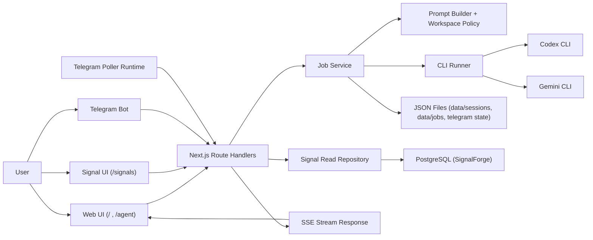
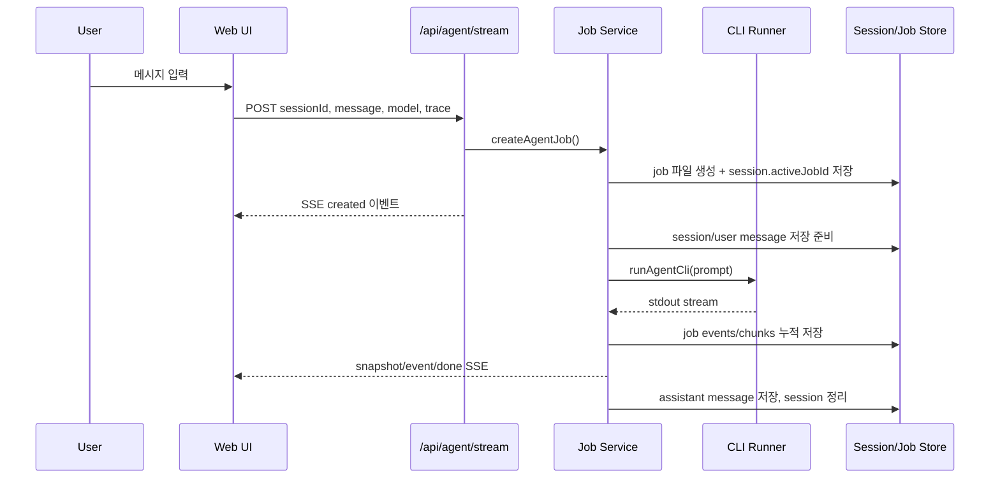
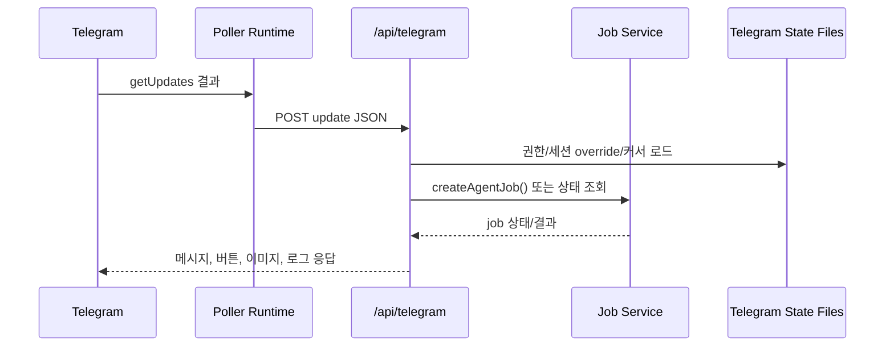

# Architecture

## 1. 개요

Codexia는 Next.js 기반 웹 애플리케이션 위에 로컬 JSON 저장소, CLI 실행 계층, 그리고 SignalForge용 PostgreSQL read spine을 얹은 단일 저장소 구조다.

현재 아키텍처의 핵심 특징은 다음과 같다.

- 웹 UI, API, 세션 저장, job 실행이 한 저장소 안에서 함께 동작한다.
- 실제 AI 실행은 서버가 Codex CLI 또는 Gemini CLI를 child process로 실행하는 방식이다.
- agent 세션과 job 상태는 `data/` 아래 JSON 파일로 유지하고, SignalForge live snapshot은 PostgreSQL을 우선 읽는다.
- 웹은 SSE로 job 이벤트를 구독하고, Telegram은 같은 job 계층을 재사용한다.

## 2. 시스템 컨텍스트



## 3. 기술 스택

- Framework: Next.js 16.1.6 App Router
- UI: React 19.2.3
- Language: TypeScript 5
- Styling: Tailwind CSS 4
- Runtime: Node.js Route Handlers + Node child_process
- Storage: Local JSON files + PostgreSQL (SignalForge live data)
- Integration: Telegram Bot API

## 4. 디렉터리 구조

```text
app/
  agent/
  api/
components/
config/
data/
db/
docs/
lib/
  theme/
src/
  application/
  core/
  infrastructure/
  presentation/
```

### 역할 요약

- `app`
  - Next.js 페이지와 API 진입점
- `components`
  - 홈/레이아웃/테마 관련 공용 UI
- `config`
  - Telegram 응답 스타일 프롬프트 등 설정 파일
- `data`
  - 세션, job, Telegram 상태, 첨부 파일, 로그 저장소
- `db`
  - SignalForge migration SQL
- `src/core`
  - 타입, 모델 정의, 프롬프트/정책 계산
- `src/application`
  - job 생성, 실행, 취소, stale 복구 오케스트레이션
- `src/infrastructure`
  - CLI 실행기, 세션 파일 저장소, Telegram poller, Next runtime wrapper
- `src/presentation`
  - 서버 스트림 응답과 웹 ViewModel/UI 조합

## 5. 계층별 설계

### 5.1 Core

`src/core`는 제품 규칙과 공용 타입을 가진다.

- `agent/types.ts`
  - `Session`, `Message`, `AgentJob`, `AgentJobEvent`, `AgentJobStreamEvent` 정의
- `agent/models.ts`
  - 지원 모델, provider 매핑, context length 정의
- `agent/reasoning.ts`
  - reasoning effort enum 정의
- `agent/prompt-builder.ts`
  - 입력 검증, 동적 컨텍스트 예산 계산, 프롬프트 문자열 조립
- `workspace/policy.ts`
  - 워크스페이스 루트, 보호 경로, 코어 경로, Telegram 전용 프롬프트 결합

### 5.2 Application

`src/application/agent/job-service.ts`가 핵심 오케스트레이터다.

주요 책임은 다음과 같다.

- 새 job 생성
- 세션당 단일 활성 job 보장
- CLI 실행 시작과 상태 전이
- heartbeat 갱신과 stale job 복구
- trace/fast 모드별 스트림 처리
- 세션 메시지 저장과 자동 제목 생성
- 활성 job 취소 및 전체 취소

### 5.3 Infrastructure

- `infrastructure/agent/codex-cli-executor.ts`
  - Codex/Gemini CLI 경로 해석, child process 실행, stdout stream 제공
- `infrastructure/agent/session-file-store.ts`
  - 세션 파일 읽기/쓰기/삭제/요약
- `infrastructure/db/postgres.ts`
  - SignalForge PostgreSQL connection pool
- `infrastructure/signals/postgres-signal-repository.ts`
  - SignalForge live snapshot / source health read model
- `infrastructure/web/next-runtime.ts`
  - `next dev/build --webpack` 래퍼, `TURBOPACK` 제거
- `infrastructure/telegram/poller-runtime.ts`
  - `getUpdates` long polling, 로컬 `/api/telegram` 전달
- `infrastructure/telegram/dev-poller-runtime.ts`
  - 개발 모드에서 웹 서버와 poller 동시 실행

### 5.4 Presentation

- `presentation/server/agent-request-validator.ts`
  - 요청 JSON 검증
- `presentation/server/agent-job-stream.ts`
  - SSE 응답 생성
- `presentation/web/agent/*`
  - 세션 로딩, 스트림 구독, 파일 추천, trace 표시, 입력/재시도 등 UI 상태 관리

## 6. 런타임 흐름

### 6.1 웹에서 새 job 실행



세부 동작:

- 웹은 기본적으로 `/api/agent/stream`을 사용한다.
- 최초 응답은 `created` 이벤트이며 이후 `snapshot`, `event`, `done` 이벤트가 이어진다.
- trace가 꺼져 있으면 stdout chunk를 바로 assistantText에 누적한다.
- trace가 켜져 있으면 JSON 라인 이벤트를 파싱한다.

### 6.2 기존 활성 job 이어보기

1. 클라이언트가 `/api/sessions/[sessionId]`로 세션을 가져온다.
2. 세션에 `activeJobId`가 있으면 `/api/jobs/[jobId]/stream`으로 연결한다.
3. 서버는 job 파일을 폴링하며 snapshot/event/done SSE를 계속 보낸다.

### 6.3 Telegram 흐름



Telegram은 두 가지 진입 방식을 가진다.

- Bot API webhook 스타일로 `/api/telegram` 직접 호출
- 로컬 개발용 poller가 `getUpdates` 결과를 `/api/telegram`으로 전달

지원 범위:

- 텍스트 명령 처리
- 세션 전환 버튼
- 첨부 파일 다운로드 후 로컬 경로를 프롬프트에 주입
- URL 스크린샷과 로컬 화면 캡처 전송
- 최근 이벤트 로그 조회

## 7. API 표면

| 경로 | 메서드 | 역할 |
| --- | --- | --- |
| `/api/agent` | `POST` | job 생성 후 `202` JSON 반환 |
| `/api/agent/stream` | `POST` | job 생성과 동시에 SSE 스트림 반환 |
| `/api/jobs/[jobId]` | `GET` | job snapshot과 누적 이벤트 조회 |
| `/api/jobs/[jobId]/stream` | `GET` | 기존 job SSE 스트림 구독 |
| `/api/jobs/cancel-all` | `POST` | 모든 활성 job 취소 |
| `/api/sessions` | `GET` | 세션 목록 조회 |
| `/api/sessions` | `POST` | 활성 job 전체 취소 |
| `/api/sessions/[sessionId]` | `GET` | 세션 상세 조회 |
| `/api/sessions/[sessionId]` | `DELETE` | 세션 삭제 |
| `/api/files` | `GET` | 파일 자동완성용 경로 검색 |
| `/api/telegram` | `POST` | Telegram update 처리 |

## 8. 데이터 모델

### 8.1 Session

세션은 `data/sessions/{sessionId}.json`에 저장된다.

주요 필드:

- `sessionId`
- `createdAt`
- `updatedAt`
- `title`
- `model`
- `reasoningEffort`
- `activeJobId`
- `messages[]`

### 8.2 AgentJob

job은 `data/jobs/{jobId}.json`에 저장된다.

주요 필드:

- `jobId`
- `sessionId`
- `message`
- `model`
- `reasoningEffort`
- `trace`
- `source`
- `status`
- `assistantText`
- `usage`
- `contextMeta`
- `events[]`
- `heartbeatAt`
- `startedAt`
- `completedAt`

### 8.3 AgentJobEvent

이벤트 타입:

- `chunk`
- `reasoning`
- `command`
- `status`
- `usage`
- `metric`
- `error`

trace 모드에서 UI가 해석하는 핵심 이벤트는 다음과 같다.

- reasoning 로그
- command 시작/완료
- usage 토큰 정보
- `ttfb_ms` metric

## 9. 저장소와 파일 경로

현재 `data/` 아래 주요 파일/디렉터리:

- `data/sessions/`
- `data/jobs/`
- `data/telegram-authorized-chats.json`
- `data/telegram-session-overrides.json`
- `data/telegram-completion-cursors.json`
- `data/telegram-events.log`
- `data/telegram-files/`
- `data/telegram-screenshots/`
- `data/telegram-poller-state.json`

SignalForge live read는 별도 PostgreSQL 테이블을 사용한다.

- `signal_delivery_snapshots`
- `signal_source_runs`
- `signal_snapshots`
- `recommendation_runs`
- `recommendation_items`

설계 의도:

- 사람 읽기 가능한 포맷으로 디버깅을 쉽게 한다.
- agent runtime은 파일 기반으로 단순성을 유지하고, SignalForge만 먼저 DB spine으로 옮긴다.

트레이드오프:

- 대량 데이터/다중 인스턴스 운영에는 부적합하다.
- 동시성 제어와 원자성 보장이 제한적이다.

## 10. CLI 실행 설계

CLI 실행기는 provider별 공통 인터페이스를 가진다.

### Codex

- 명령 기본형: `codex exec --skip-git-repo-check --sandbox danger-full-access`
- trace 시 `--json` 사용
- reasoning effort는 `-c model_reasoning_effort="..."`로 전달

### Gemini

- 명령 기본형: `gemini --approval-mode yolo --sandbox=false`
- trace 시 `--output-format stream-json` 사용
- reasoning effort는 현재 사용하지 않는다

### 경로 해석 순서

1. provider별 환경변수
2. `PATH`
3. 사용자 홈/일반 설치 경로 fallback

예시:

- Codex: `CODEX_CLI_PATH`, `CODEX_PATH`
- Gemini: `GEMINI_CLI_PATH`, `GEMINI_PATH`

## 11. 프롬프트 및 워크스페이스 정책

프롬프트는 다음 구성으로 만들어진다.

```text
System: <base prompt + workspace policy + optional telegram style>
Conversation:
<<<CONVERSATION>>>
...
<<<END_CONVERSATION>>>
User:
<<<USER_MESSAGE>>>
...
<<<END_USER_MESSAGE>>>
```

정책 계층:

- `AGENT_WORKSPACE_ROOT`
  - 작업 기준 루트
- `AGENT_PROTECTED_PATHS`
  - 읽기/검색/수정/목록 조회까지 금지할 불가침 경로
- 코어 경로
  - 현재 `src/core`는 사용자의 명시적 허락이 있을 때만 수정 대상으로 간주
- Telegram 응답 스타일
  - 파일 기반 또는 인라인 프롬프트 추가 가능

## 12. 웹 UI 구조

### 홈 화면

- 세션 목록
- 활성 작업 일괄 종료
- 워크스페이스 진입

### 에이전트 화면

- 세션 식별
- 모델 선택
- 사고수준 선택
- trace 토글
- 컨텍스트 사용량 도넛
- 메시지 스트림 표시
- `@파일경로` 자동완성

### 테마

현재 네 가지 테마가 있다.

- `midnight`
- `dawn`
- `forest`
- `dark`

## 13. Telegram 기능 구조

`/api/telegram`은 단일 파일이지만 다음 책임을 함께 가진다.

- Bot API 요청/응답 래핑
- chat 권한 검증
- 세션 선택 및 override 저장
- 모델/사고수준 변경
- job 상태/목록 조회
- 첨부 파일 다운로드
- 스크린샷 생성 및 이미지 응답
- 이벤트 로그 조회

실무적으로는 기능이 많은 파일이므로 향후 모듈 분리가 유력한 후보 영역이다.

## 14. 안정성 전략

현재 반영된 안정성 장치는 다음과 같다.

- job heartbeat 기록
- stale job 자동 실패 처리
- session.activeJobId 정리 로직
- 기존 활성 job 재연결
- CLI 타임아웃
- Telegram poller 상태 파일(offset) 저장

## 15. 제약과 리스크

### 단일 프로세스 가정

- `runningJobIds`, `runningJobCancels`, `cancelledJobIds`는 메모리 기반이다.
- 따라서 활성 취소 제어는 현재 서버 프로세스 범위 안에서 가장 잘 동작한다.

### 파일 저장소 한계

- 파일 기반 저장은 구현이 단순하지만 경쟁 상태에 취약하다.
- 세션/잡 수가 커질수록 목록 조회와 복구 비용이 증가한다.

### 웹 인증 부재

- 현재 웹 라우트에는 사용자 인증이 없다.
- 외부 공개 배포 시 리버스 프록시, 네트워크 ACL, 별도 인증 계층이 필요하다.

### 대형 Telegram route

- 기능이 집중되어 있어 변경 영향 범위가 넓다.
- 테스트와 모듈 분리 우선순위가 높은 영역이다.

## 16. 추천 후속 작업

- `app/api/telegram/route.ts` 기능 분해
- JSON 저장소를 SQLite로 이전
- web auth 추가
- job 이벤트 보존/정리 정책 추가
- API 계약 문서와 e2e 시나리오 문서 분리
