# SignalForge 구조 설명서

이 문서는 [ai_signal_dashboard_plan.docx](./ai_signal_dashboard_plan.docx)를 바탕으로 SignalForge를 "무엇을 하는 시스템인지", "어떤 층으로 움직이는지", "사용자에게 어떤 판단 구조를 전달하는지" 중심으로 다시 설명한 구조 문서다.

핵심 전제는 단순하다. SignalForge는 자동으로 주문을 실행하는 시스템이 아니라, 시장 판단에 필요한 여러 신호를 하나의 일관된 구조로 통합해 보여주는 판단 보조 시스템이다.

## 1. SignalForge가 하는 일

SignalForge는 거시경제, 가격 구조, 시장 심리, 뉴스/컨센서스를 한 흐름으로 엮어 SPY와 QQQ의 현재 시장 상태를 읽어낸다. 결과는 단순 숫자 하나가 아니라 점수, 레짐, 액션, 근거, 데이터 최신성까지 포함한 "설명 가능한 시그널" 형태로 제공된다.

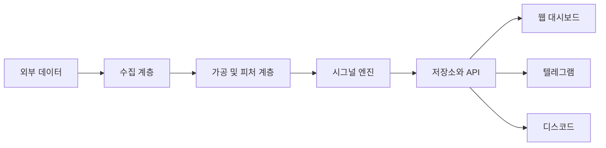

### 사용자에게 보이는 최종 산출물

- 종합 점수: 0~100
- 시장 레짐: Risk-On, Neutral, Risk-Off, Panic, Recovery, Euphoria
- 최종 액션: Strong Buy / Buy / Hold / Sell / Strong Sell
- 구성 점수: Macro / Technical / Sentiment / News-Consensus
- 근거 요약: 왜 이런 결과가 나왔는지에 대한 설명
- 상태 정보: 최신 업데이트 시각, stale 여부, override 적용 여부

## 2. 시스템을 관통하는 원칙

SignalForge는 기능을 많이 붙이는 방향보다, 판단 체계를 흔들리지 않게 유지하는 방향에 더 가깝다.

- 자동매매보다 판단 보조를 우선한다.
- 단일 지표가 아니라 복수 축의 일관된 결론을 만든다.
- 강한 시그널일수록 근거와 예외 규칙이 함께 따라와야 한다.
- 데이터가 낡았거나 충돌하면 강한 액션보다 보수적 해석을 택한다.
- 계산과 전달을 분리해, 수집/추론 계층과 사용자 노출 계층의 책임을 나눈다.

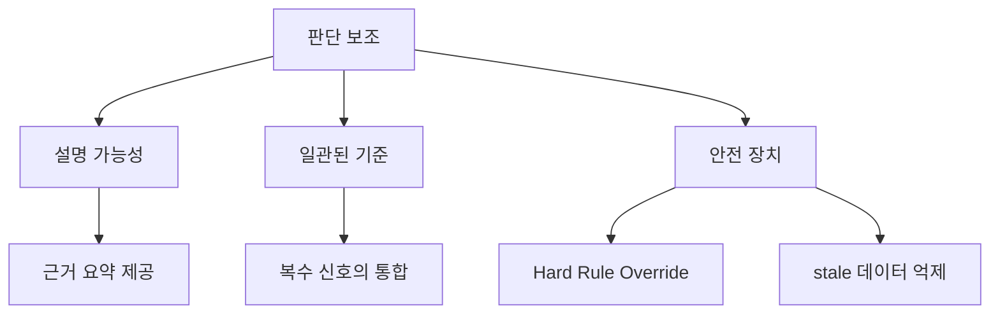

## 3. 5계층 구조

문서의 중심 구조는 5개 계층이다. 각 층은 앞 단계의 결과를 받아 더 높은 수준의 해석으로 변환한다.

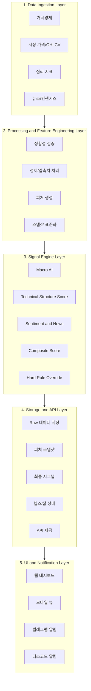

### 3.1 Data Ingestion Layer

이 층은 외부 세계를 시스템 내부로 들여오는 관문이다. 원문 기준 수집 대상은 다음 네 갈래다.

- 거시경제: CPI, 기준금리, 실업률, 장단기 금리차
- 시장 심리: Fear & Greed, VIX
- 가격 및 기술 데이터: SPY, QQQ의 OHLCV와 각종 파생 지표
- 뉴스/컨센서스: 뉴스 감성, 애널리스트 평가 변화

이 층의 역할은 "좋은 데이터를 해석하는 것"이 아니라 "해석 가능한 형태로 신뢰성 있게 가져오는 것"이다.

### 3.2 Processing and Feature Engineering Layer

수집된 데이터는 그대로는 비교하기 어렵다. 그래서 이 층에서 정합성 확인, 결측치 처리, 타임스탬프 정리, 스냅샷 표준화가 이뤄진다.

여기서 중요한 것은 데이터의 양보다 데이터의 상태다. 어떤 수치가 최신인지, 누락됐는지, 전일 데이터가 섞였는지 같은 맥락이 이후 시그널 강도를 좌우한다.

### 3.3 Signal Engine Layer

이 층은 SignalForge의 핵심이다. 다양한 입력을 투자 판단 언어로 번역하는 부분이기 때문이다.

- Macro AI: 거시/환경 변수 기반 방향성 판단
- Technical Structure Score: 가격 구조와 반응의 정량화
- Sentiment and News: 공포/탐욕, 변동성, 뉴스 분위기 반영
- Composite Score: 여러 축을 하나의 점수로 통합
- Hard Rule Override: 점수의 과감함을 제어하는 안전장치

### 3.4 Storage and API Layer

이 층은 단순 저장소가 아니라 "판단 기록 보관소"에 가깝다. Raw 데이터, 피처 스냅샷, 모델 예측, 최종 시그널, 구성 점수, 알림 이력, 잡 상태가 모두 여기에 남는다.

사용자는 웹이나 텔레그램에서 결과만 보지만, 시스템은 이 층 덕분에 "왜 이렇게 말했는지"를 나중에도 되짚을 수 있다.

### 3.5 UI and Notification Layer

최종적으로 사용자가 접하는 층이다. 여기서 중요한 것은 정보량이 아니라 정보 전달의 밀도다.

- 웹/모바일은 한눈에 현재 시장 상태를 읽게 해야 한다.
- 알림 채널은 등급 변화, 변동성 경고, 운영 이상을 빠르게 전달해야 한다.
- 액션뿐 아니라 그 근거가 바로 따라와야 한다.

## 4. 데이터는 어떻게 시그널이 되는가

SignalForge는 수집에서 끝나지 않는다. "원천 데이터"가 "행동 가능한 해석"으로 바뀌는 순서가 정해져 있다.

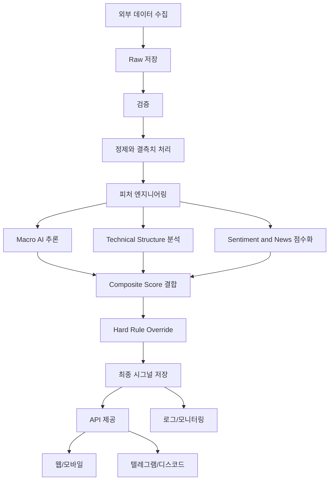

이 흐름에서 중요한 점은 "추론"보다 "결합과 제어"다. SignalForge는 AI 결과 하나를 곧바로 보여주지 않고, 여러 레이어의 결과를 묶은 뒤 예외 규칙으로 다듬어서 최종 액션을 만든다.

## 5. 점수 구조와 해석 방식

문서의 권장 초기 비중은 아래와 같다.

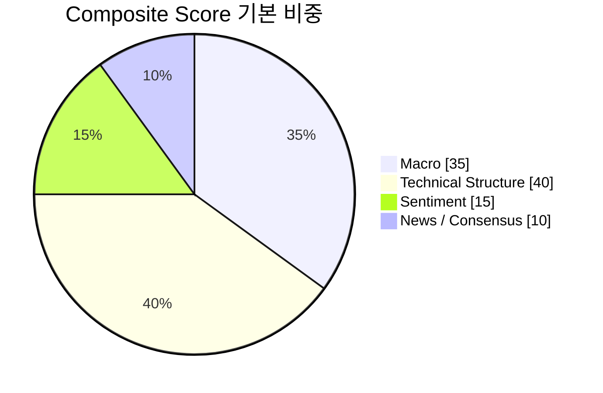

이 비중은 단순한 UI 장식이 아니라 해석 우선순위를 드러낸다.

- Macro는 시장의 큰 환경을 읽는다.
- Technical Structure는 현재 가격 행동의 구조적 강약을 읽는다.
- Sentiment는 투자 심리의 압력을 읽는다.
- News/Consensus는 정성 흐름의 방향을 보정한다.

즉 SignalForge는 "가격만 보는 시스템"도 아니고, "뉴스만 해석하는 시스템"도 아니다. 큰 환경, 현재 구조, 심리, 서사를 한 화면에 올려놓는 방식이다.

## 6. Technical Structure Score가 중요한 이유

원문에서 가장 비중 있게 강조되는 부분은 기술적 분석 모듈의 고도화다. 단순 RSI/MACD 점수가 아니라, 시장 구조와 가격 반응을 읽는 멀티 레이어 엔진으로 재정의된다.

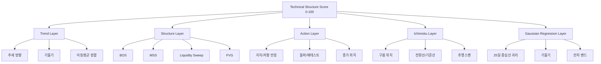

이 구조의 의미는 명확하다. SignalForge는 캔들 한 개를 맞히려는 시스템이 아니라, 가격이 어느 구조 안에서 어떻게 반응하는지를 읽는 시스템이다.

### 왜 별도 레이어로 쪼개는가

- 추세는 방향을 알려준다.
- 구조는 시장이 바뀌는 지점을 알려준다.
- 액션은 실제 반응의 질을 알려준다.
- 일목균형표는 추세 상태와 전환 가능성을 보완한다.
- Gaussian Regression은 과열과 평균회귀 가능성을 수치화한다.

결국 Technical Structure Score는 기술지표 모음이 아니라 "시장 구조 해석기"에 가깝다.

## 7. Hard Rule Override는 왜 필요한가

Composite Score가 높더라도 시장이 실제로는 취약할 수 있다. 그래서 SignalForge는 점수 시스템 위에 안전장치를 한 층 더 둔다.

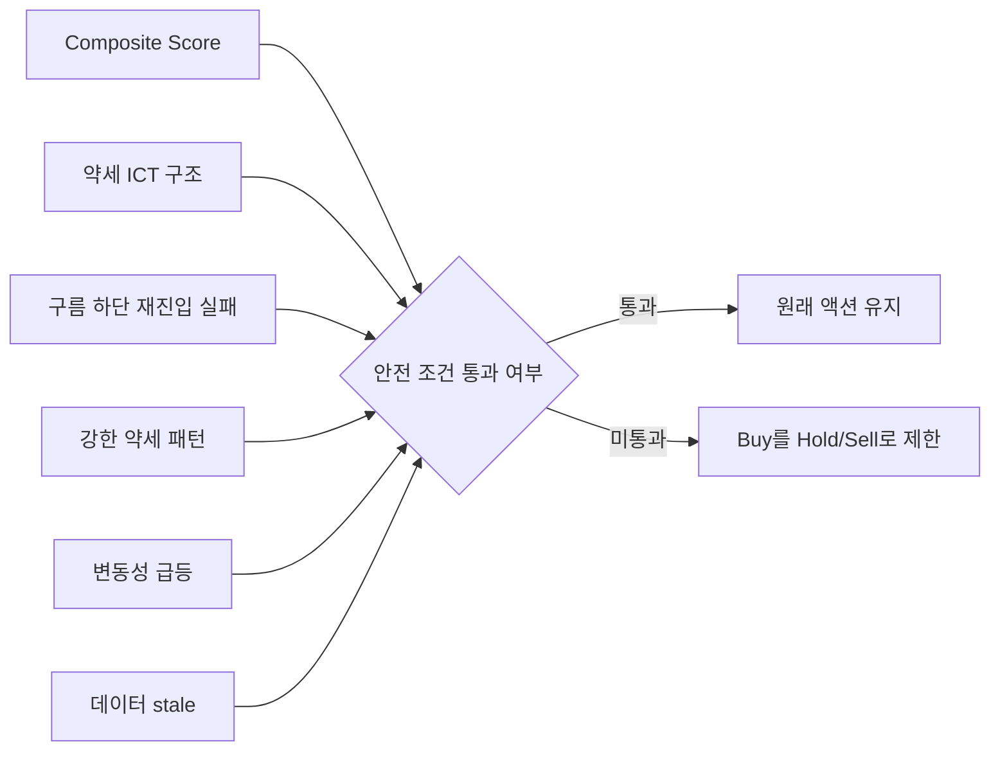

이 장치는 두 가지 의미를 가진다.

- 시그널이 공격적으로 보여도 실제 운용은 보수적으로 만들 수 있다.
- 데이터 상태가 나쁘면 "판단 보조 시스템"답게 과감한 액션을 억제할 수 있다.

즉 Override는 AI를 부정하는 층이 아니라, 제품 전체의 신뢰도를 지키는 층이다.

## 8. 저장 구조는 무엇을 보존하는가

SignalForge의 저장소는 단순 캐시가 아니라 판단 과정 전체를 기록하는 구조다.

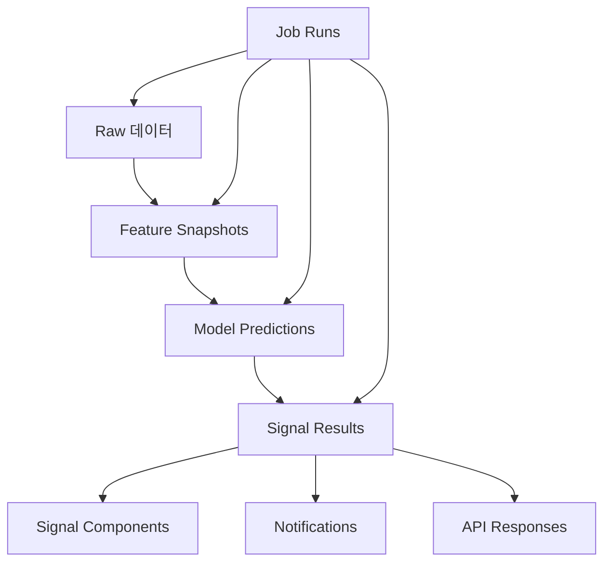

원문에서 권장하는 핵심 엔티티는 아래 범주로 묶을 수 있다.

- 자산 정보: 어떤 티커와 자산군을 다루는가
- Raw 데이터: 수집한 원천 자료
- Feature Snapshots: 계산 가능한 형태로 정리된 입력
- Model Predictions / Signal Results: 추론 및 최종 판단
- Signal Components: 구성 점수와 근거
- Notifications / Jobs: 운영과 전달 이력

이 구조가 있으면 사용자는 "지금 점수가 왜 이렇지?"를 볼 수 있고, 운영자는 "어디서 문제가 생겼지?"를 추적할 수 있다.

## 9. 사용자에게는 어떻게 보이는가

사용자 경험은 복잡한 계산을 느끼게 하기보다, 지금 시장 상태를 빠르게 파악하게 하는 쪽으로 설계된다.

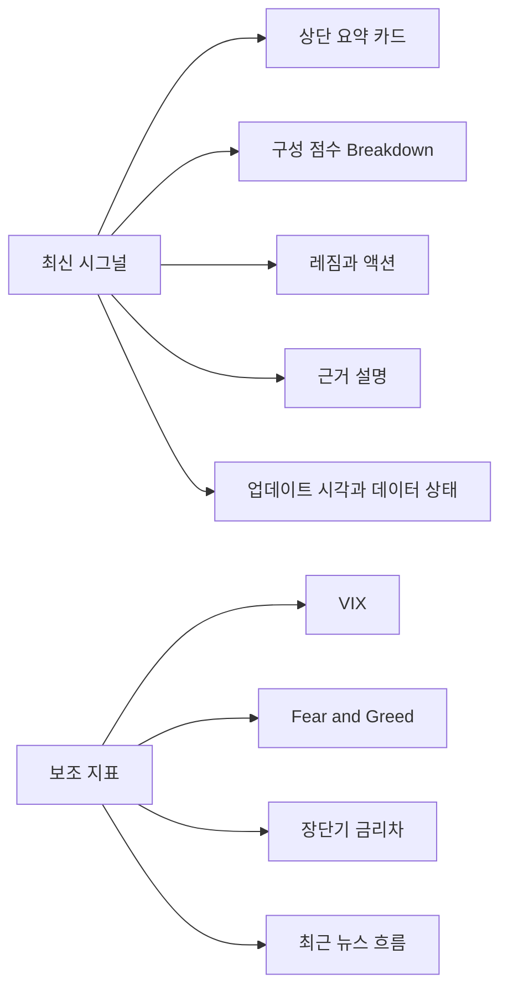

웹/모바일에서는 10초 안에 현재 상태를 읽게 해야 하고, 텔레그램/디스코드에서는 변화가 생겼을 때 즉시 해석 가능한 문장으로 전달돼야 한다.

그래서 SignalForge의 출력은 "정답"을 선언하는 방식보다 "현재 시장을 이렇게 읽고 있다"를 전달하는 방식에 가깝다.

## 10. 운영 구조는 어떤 리듬으로 움직이는가

문서는 일별 종합 배치와 장중 경량 업데이트를 분리한다. 이 구분은 계산 비용과 판단 신선도를 함께 관리하기 위한 것이다.

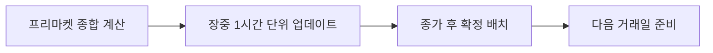

운영 관점에서 SignalForge는 세 가지를 계속 감시해야 한다.

- 수집이 성공했는가
- 데이터가 최신인가
- 추론과 알림이 정상적으로 끝났는가

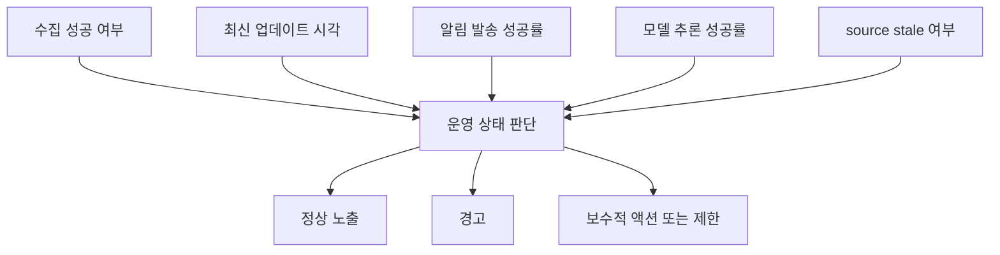

이 운영 관점이 중요한 이유는, SignalForge가 예측 모델이면서 동시에 사용자-facing 제품이기 때문이다. 예측 정확도만 높아도 충분하지 않고, 데이터와 상태가 믿을 만해야 한다.

## 11. SignalForge가 아닌 것

문서상 범위를 명확히 하기 위해, 이 시스템이 하지 않는 것도 같이 봐야 한다.

- 자동 주문 실행
- 증권사 API를 통한 체결 자동화
- 포지션 운용 자동화
- 리밸런싱 자동화

즉 SignalForge는 execution engine이 아니라 decision engine이다.

## 12. 한 문장으로 정리하면

SignalForge는 여러 시장 신호를 한곳에 모아 보여주는 대시보드가 아니다. 여러 시장 신호를 하나의 일관된 판단 체계로 바꾼 뒤, 그 결과를 설명 가능한 형태로 전달하는 구조화된 시그널 시스템이다.
